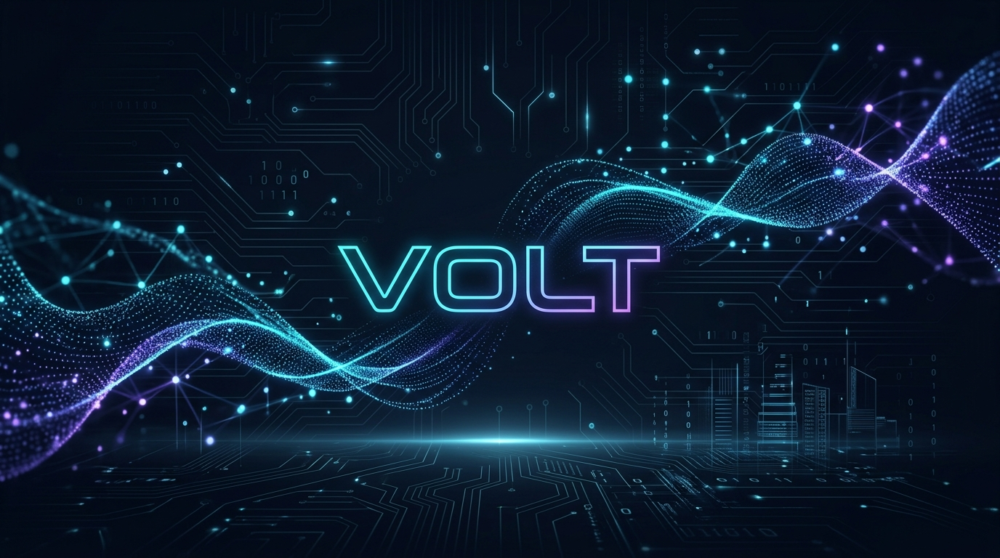

<div align="center">

  <!-- Hero Banner -->
  <a href="https://roninvolt.vercel.app/" target="_blank">
    
  </a>

  <br/><br/>

  <!-- Main Animated Heading -->
  <h1>
    
    Hey there! I'm <span style="color:#38bdf8;">Varun</span> (aka <b>Volt</b> • <a href="https://github.com/roninvolt">@roninvolt</a>)
  </h1>

  <!-- Dynamic Typing Subtitle -->
  <a href="https://roninvolt.vercel.app/" target="_blank">
    
  </a>

  <br/>

  <!-- Status Badges Bar -->
  <p align="center">
    <a href="https://roninvolt.vercel.app/" target="_blank">
      
    </a>
    <a href="https://discord.com/invite/uUjqYU4dRp" target="_blank">
      
    </a>
    <a href="https://github.com/roninvolt?tab=followers">
      
    </a>
    
  </p>

</div>

---

### 👨‍💻 About Me

```yaml
identity:
  name: Varun
  alias: Volt (roninvolt)
  role: AI Engineer & Founder of Voxen Development
  education: 3rd Year B.E. AIML @ KGISL Institute of Technology (KiTE), Coimbatore
  core_domains: [Autonomous AI Agents, Deep Learning, Cloud Microservices, Full-Stack Systems]
  portfolio: "https://roninvolt.vercel.app"
  mission: "Engineering resilient autonomous agents and production systems that bridge research with industry."
```

- 🏢 **Voxen Development**: Founder & Lead Architect designing intelligent automation tools, server infrastructure, and developer utilities.
- 🤖 **Artificial Intelligence & Agents**: Engineering agentic workflows (LangGraph / LangChain), automated code reviewers, and deep learning audio signal denoising models.
- 🚀 **Full-Stack & Cloud**: Architecting scalable web applications, REST/WebSocket APIs, and containerized microservices with **Docker**, **Nginx**, **Node.js**, and **FastAPI**.
- ⚡ **Modern Web Experiences**: Crafting ultra-fast, responsive web applications with **React**, **TypeScript**, **Vite**, and **Tailwind CSS**.
- 💬 **Ask Me About**: Agentic AI patterns, PyTorch, Docker orchestration, Discord bot scalability, and full-stack system architecture.

---

### 🛠️ Tech Arsenal & Stack

<div align="center">

| Domain | Technologies & Frameworks |
| :--- | :--- |
| **Languages** |      |
| **AI & Machine Learning** |      |
| **Frontend & UI** |      |
| **Backend & APIs** |     |
| **Cloud & DevOps** |     |
| **Databases & Tools** |       |

</div>

---

### 🌟 Featured Repositories & Creations

<div align="center">

| Project | Description | Stack | Link |
| :--- | :--- | :--- | :---: |
| 🤖 **AI-Code-Reviewer** | Autonomous AI agent performing intelligent static code inspection, vulnerability detection, and refactoring analysis. | `Python` `LangGraph` `AI Agents` `FastAPI` | [**Inspect**](https://github.com/roninvolt/AI-Code-Reviewer) |
| 🎙️ **Ai-Driven-Noise-Reduction** | Deep neural network audio enhancement pipeline isolating speech frequencies and canceling background noise. | `Python` `PyTorch` `Signal Processing` | [**Inspect**](https://github.com/roninvolt/Ai-Driven-Noise-Reduction) |
| ☁️ **Voxen-Cloud-Service-Portal** | Enterprise-grade cloud service portal engineered with microservice architecture, Nginx reverse proxy, and Docker. | `JavaScript` `Docker Compose` `Nginx` `Node.js` | [**Inspect**](https://github.com/roninvolt/Voxen-Cloud-Service-Portal) |
| ⚡ **LocalBiz-AI-Automations** | Complete business automation platform providing AI-powered operational audits and dynamic marketing tools. | `TypeScript` `React` `Tailwind CSS` `Vite` | [**Inspect**](https://github.com/roninvolt/LocalBiz-AI-Automations) |
| 👾 **Xalven & Discord Bot** | Production-ready, modular Discord assistant with comprehensive moderation, automated workflows, and community management. | `JavaScript` `Node.js` `Discord.js` `Docker` | [**Inspect**](https://github.com/roninvolt/Xalven) |
| 🛍️ **boutique-bliss** | Modern, responsive e-commerce web platform engineered for peak performance and elegant customer checkout flows. | `TypeScript` `React` `Tailwind` `Bun` | [**Inspect**](https://github.com/roninvolt/boutique-bliss) |

</div>

---

### 📊 GitHub Activity & Insights

<div align="center">

  <table border="0" cellspacing="0" cellpadding="0">
    <tr align="center">
      <td width="50%">
        <a href="https://github.com/roninvolt">
          
        </a>
      </td>
      <td width="50%">
        <a href="https://github.com/roninvolt">
          
        </a>
      </td>
    </tr>
    <tr align="center">
      <td colspan="2" width="100%">
        <br/>
        <a href="https://github.com/roninvolt">
          
        </a>
      </td>
    </tr>
  </table>

  <br/>

  <!-- 🐍 Contribution Snake Animation (Automated daily) -->
  <picture>
    <source media="(prefers-color-scheme: dark)" srcset="https://raw.githubusercontent.com/roninvolt/roninvolt/output/github-contribution-grid-snake-dark.svg">
    <source media="(prefers-color-scheme: light)" srcset="https://raw.githubusercontent.com/roninvolt/roninvolt/output/github-contribution-grid-snake.svg">
    
  </picture>

</div>

---

### ⚡ Recent GitHub Activity

<!--START_SECTION:activity-->
1. 🚀 Pushed commits to [roninvolt/roninvolt](https://github.com/roninvolt/roninvolt)
2. 🤖 Worked on [roninvolt/AI-Code-Reviewer](https://github.com/roninvolt/AI-Code-Reviewer)
3. 🎙️ Refined deep learning pipeline in [roninvolt/Ai-Driven-Noise-Reduction](https://github.com/roninvolt/Ai-Driven-Noise-Reduction)
<!--END_SECTION:activity-->

---

### 🤝 Let's Connect & Collaborate

<div align="center">

  <a href="https://roninvolt.vercel.app/" target="_blank">
    
  </a>
  &nbsp;
  <a href="https://discord.com/invite/uUjqYU4dRp" target="_blank">
    
  </a>
  &nbsp;
  <a href="mailto:roninvolt1@gmail.com" target="_blank">
    
  </a>
  &nbsp;
  <a href="https://github.com/roninvolt" target="_blank">
    
  </a>

</div>

<br/>

<details>
<summary>💡 <b>Click to expand: Developer Environment & Workflow</b></summary>
<br/>

- **Primary OS**: Windows 11 & Linux (WSL2 / Ubuntu)
- **Terminal & Shell**: PowerShell, Zsh, Bash
- **Primary IDE**: Visual Studio Code with tailored productivity extensions
- **Containerization**: Docker Desktop & Docker Compose
- **Design & UI**: Responsive Mobile-First Architecture, Modern Glassmorphism
- **Philosophy**: *Automate everything, keep architectures decoupled, and optimize for long-term maintainability.*

</details>

<br/>

<div align="center">
  <sub>⚡ Designed with precision by <a href="https://roninvolt.vercel.app/">Varun (Volt)</a> • <i>"Engineering the intersection of raw models and production systems."</i></sub>
</div>
